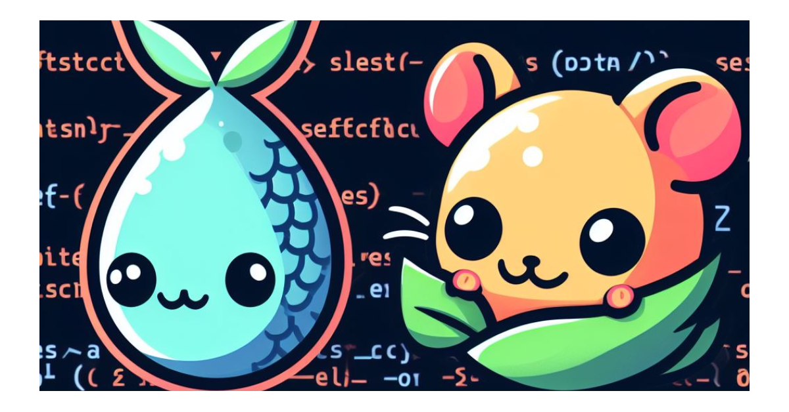

This repository contains my dotfiles, organized and managed with the dotfile management tool, [chezmoi](https://www.chezmoi.io/). These dotfiles allow me to customize and configure my development environment to suit my workflow and preferences.


### Installation

You can install it by running the following command:

```sh
sh -c "$(curl -fsLS get.chezmoi.io)" -- init --apply Rodent1
```

## Prerequisites for Full Personal Setup

To take full advantage of the personalization and security features in this repository, you'll need the following:

1. **1Password Service Account**: This repository relies on 1Password for securely storing secrets and sensitive information. To access and manage these secrets, you'll need a 1Password service account. You can sign up for one at [1Password](https://1password.com/).

2. **Atuin Registration**: Atuin registration is required to synchronise terminal history between different machines. Read more at [Atuin](https://atuin.sh/).


## License

This project is dedicated to the public domain through the [Unlicense](https://unlicense.org). You are free to use, modify, and distribute this configuration as you see fit.
